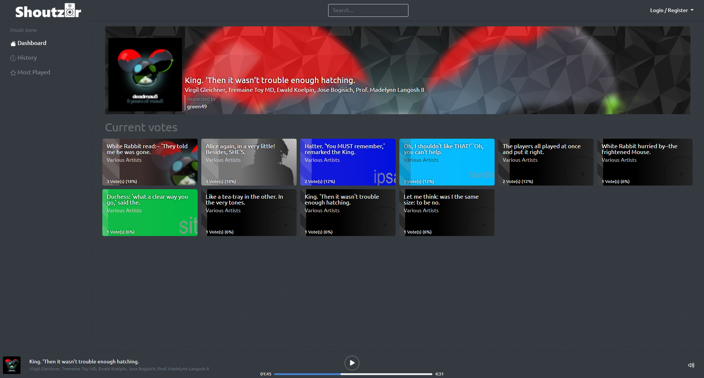

# Shoutz0r

1. [Introduction](#introduction)
2. [Installation](#installation)
3. [Development](#development)
   1. [Alternative Docker setup](#alternative-docker-setup)
   2. [Front-end development](#frontend-development)
4. [Composer commands](#composer-commands)
5. [Docker container diagram](#docker-container-diagram)
6. [Kindly Supported by](#kindly-supported-by)
7. [Sponsor this project](#sponsor-this-project)

## Introduction

Shoutz0r - A media voting system perfect for events such as lan-parties!\
Comes with autoDJ to keep requests going when no requests have been added by users.

PLEASE NOTE: Shoutz0r is currently still under heavy development & lacks major functionality. If interested, please "
watch" the repository to receive a notification when the first release is created.

Shoutz0r gives users a platform to upload different kinds of media, and vote on what they would like to hear or watch (
yes it supports videos too!).\
The queue can be generated based on the amount of votes, or as a regular queue (first come, first serve).

Built using Laravel, Vue, GraphQL (Lighthouse) & Apollo.

API Docs & Storybook can be found over at [shoutzor.com](https://www.shoutzor.com). \
Documentation has yet to be written. Feel free to ask any questions in the `discussions`.

## Installation:

Navigate to where you installed the files, from there:

1. Copy `.env.template` to `.env` and edit the values to what you'd like them to be.
   When you run the `docker-compose` commands it will use these values for the configuration.

2. Make sure that whatever hostname is used is correctly updated in your `hosts` file or DNS server. By default this is set to `shoutzor.local`.

3. Run `docker-compose up`. This will set up a basic and simple docker network with a few containers pre-configured for use.

4. When docker-compose is up and running, make sure to run `composer install-shoutzor` in the `app` container. You can do this from your host by running `docker-compose run app composer install-shoutzor`

5. After installation is complete, make sure to restart the `queueWorker` container (or just restart them all via `docker-compose restart`)

You can now access the app on `shoutzor.local` (or your own hostname if you changed this in `.env`).\
The default login is admin/admin

Please note: if you experience issues and are using a customized `docker-compose.yml` file; verify the issues persist when you use the original file before reporting the issue.

I will not be providing support to any docker-related issues you may experience after customizing the `docker-compose.yml`.  If you have improvements however, by all means please create a discussion or issue (or even better, a pull-request).\
I'm always open for feedback.

## Development:

### Alternative Docker setup:
For development environments you should run: `docker-compose -f docker-compose.yml -f docker-compose.dev.yml up`.\
This will open up ports to the MySQL and Redis containers for direct access.

Additionally, you can choose to run `composer install-shoutzor-dev` instead of `composer install-shoutzor`; This will add mock data.

### Frontend development:

If you are going to do any work on the frontend, make sure to run `npm run watch`.\

Sidenote: We use `PurgeCSS` to remove unused CSS from the compiled CSS file.\
The side-effect of this is that it will only check for used CSS selectors on initial run. If you add any new styling that isn't used anywhere else `npm run watch` will not include this styling yet. Make sure you stop and restart the watcher for these additions to be picked up.

## Composer commands:

| Command                         | Explanation                                                           |
|---------------------------------|-----------------------------------------------------------------------|
| `composer install-shoutzor`     | Installs shoutzor for production environments                         |
| `composer install-shoutzor-dev` | Installs shoutzor for development environments (adds mock data)       |
| `composer add-mock-data`        | Generates and adds mock data to the database using `DevelopmentSeeder` |

## Docker Container Diagram:

This diagram might contain some errors (please notify me if it does) but should give an idea of the way this app is setup.
The Queue worker, front-end and back-end can be setup as either separate containers (instantiated from the same "web" image), or ran from a single container.

## Kindly supported by

* [JetBrains](https://www.jetbrains.com/?from=Shoutz0r)
* [Navicat](https://www.navicat.com/)

## Sponsor this project

Shoutz0r is being developed entirely in my spare time. \
If you like this project, please consider sponsoring it using the button in the sidebar of this repo (
or [click here](https://github.com/sponsors/xorinzor) ).\
Every little bit helps to buy me a beer or pizza, which keeps me going!
